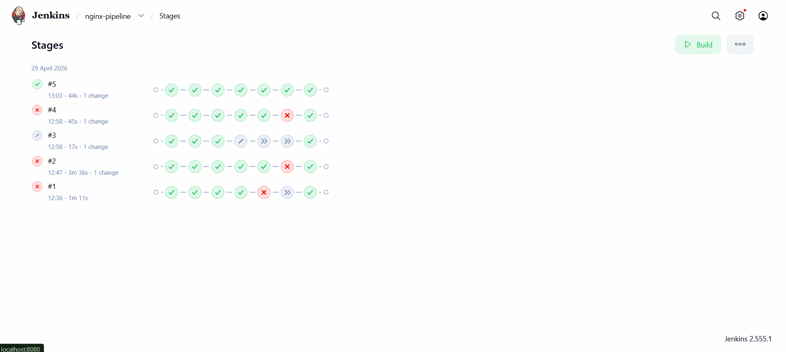
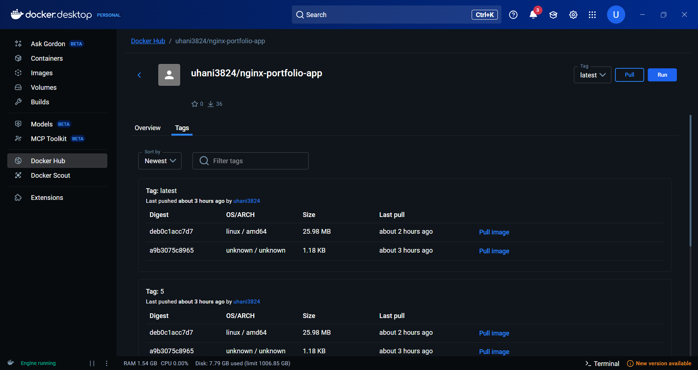

# Jenkins CI/CD Pipeline — Static HTML/Nginx App

A project demonstrating a complete Jenkins
CI/CD pipeline that builds, tests, containerises, and pushes a static
HTML website served by Nginx.

---
## Pipeline in Action

### Jenkins Stage View — All 5 stages passing


### Docker Hub — Image pushed successfully

## 🗂️ Project Structure

```
jenkins-nginx-project/
├── src/
│   └── index.html          # Static website
├── tests/
│   └── test_html.sh        # HTML validation test script
├── Dockerfile              # Docker image definition
├── nginx.conf              # Custom Nginx configuration
├── Jenkinsfile             # Jenkins declarative pipeline
└── README.md
```

---

## ⚙️ Pipeline Stages

| Stage | What it does |
|-------|-------------|
| **Checkout** | Pulls code from GitHub, prints build info |
| **Test** | Runs shell-based HTML validation tests |
| **Build Docker Image** | Builds image tagged with `BUILD_NUMBER` |
| **Verify Image** | Runs container, hits `/health` endpoint |
| **Push to Docker Hub** | Pushes image (main branch only) |
| **Cleanup** | Stops test container, removes local images |

---

## 🚀 How to Run

### Prerequisites
- Jenkins running (Docker recommended)
- Docker installed and socket mounted into Jenkins
- Docker Hub account + credentials added to Jenkins

### Jenkins Setup

1. **New Item** → name it `nginx-pipeline` → choose **Pipeline**
2. **Pipeline** section → Definition: **Pipeline script from SCM**
3. SCM: **Git** → enter your GitHub repo URL
4. Branch: `*/main`
5. Script Path: `Jenkinsfile`
6. Build Triggers: check **Poll SCM** → `H/5 * * * *`
7. **Save** → **Build Now**

### Add Docker Hub Credentials

1. Manage Jenkins → Credentials → Global → Add Credentials
2. Kind: Username with password
3. Username: your Docker Hub username
4. Password: your Docker Hub access token
5. ID: `dockerhub-creds`

### Update Image Name

In `Jenkinsfile`, change this line:
```groovy
DOCKER_USER = 'your-dockerhub-username'  // 🔁 change this
```

---

## 🐳 Run the App Locally (without Jenkins)

```bash
# Build the image
docker build -t nginx-portfolio-app .

# Run the container
docker run -d -p 8080:80 nginx-portfolio-app

# Open in browser
open http://localhost:8080

# Health check
curl http://localhost:8080/health
```

---

## 🧪 Run Tests Locally

```bash
chmod +x tests/test_html.sh
./tests/test_html.sh
```

---

## 🛠️ Tech Stack

- **Jenkins** — CI/CD automation server
- **Docker** — containerisation
- **Nginx** — web server (Alpine-based image)
- **GitHub** — source control + webhook trigger
- **Shell scripting** — test automation

---
